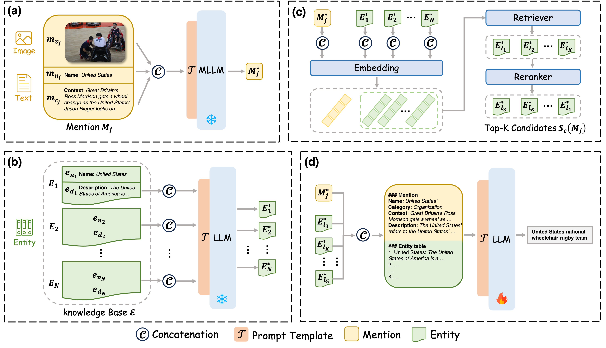

# UniMEL: A Unified Framework for Multimodal Entity Linking with Large Language Models

This repository is the official implementation for the paper titled "UniMEL: A Unified Framework for Multimodal Entity Linking with Large Language Models".

<p align="center">
  
</p>

## Usage

#### Step 1: Install and set up environment

```python
pip install -r requirements.txt
conda create -n unimel python==3.8.18
conda activate unimel
```


#### Step 2: Dataset

You may download WikiMEL and RichpediaMEL from https://github.com/seukgcode/MELBench and WikiDiverse from https://github.com/wangxw5/wikiDiverse.

#### Step 3: Train

We provide a trained checkpoint "checkpoint-2200.zip", you just need to unzip it to the current directory and record its path.

If you want to train a new checkpoint, please refer to peft (https://github.com/huggingface/peft) or swift (https://github.com/modelscope/swift).


#### Step 4: Run

```
cd UniMEL
bash run.sh 0 wikidiverse  # for wikidiverse
```


## Code Structure

```python
├─code
│  │  main.py
│  │  
│  └─untils
│      │  dataset.py
│      │  functions.py
│      │  
│      └─__pycache__
│              dataset.cpython-38.pyc
│              functions.cpython-38.pyc
│              
└─config
        wikidiverse.yaml
│  framework.png
│  README.md
│  requirements.txt
│  run.sh
```

## Results

#### Main results

<!DOCTYPE html>
<html lang="en">
<head>
<meta charset="UTF-8">
</head>
<body>
  
<table>
  <thead>
    <tr>
      <th rowspan="2">Model</th>
      <th colspan="4">Richpedia</th>
      <th colspan="4">WikiMEL</th>
      <th colspan="4">Wikidiverse</th>
    </tr>
    <tr>
      <th>Top-1</th>
      <th>Top-5</th>
      <th>Top-10</th>
      <th>Top-20</th>
      <th>Top-1</th>
      <th>Top-5</th>
      <th>Top-10</th>
      <th>Top-20</th>
      <th>Top-1</th>
      <th>Top-5</th>
      <th>Top-10</th>
      <th>Top-20</th>
    </tr>
  </thead>
  <tbody>
    <tr>
      <td>BERT</td>
      <td>&nbsp;31.6</td>
      <td>&nbsp;42.0</td>
      <td>&nbsp;&nbsp;47.6</td>
      <td>&nbsp;&nbsp;57.3</td>
      <td>&nbsp;31.7</td>
      <td>&nbsp;48.8</td>
      <td>&nbsp;&nbsp;57.8</td>
      <td>&nbsp;&nbsp;70.3</td>
      <td>&nbsp;22.2</td>
      <td>&nbsp;53.8</td>
      <td>&nbsp;&nbsp;69.8</td>
      <td>&nbsp;&nbsp;82.8</td>
    </tr>
    <tr>
      <td>BLINK</td>
      <td>&nbsp;30.8</td>
      <td>&nbsp;38.8</td>
      <td>&nbsp;&nbsp;44.5</td>
      <td>&nbsp;&nbsp;53.6</td>
      <td>&nbsp;30.8</td>
      <td>&nbsp;44.6</td>
      <td>&nbsp;&nbsp;56.7</td>
      <td>&nbsp;&nbsp;66.4</td>
      <td>&nbsp;22.4</td>
      <td>&nbsp;50.5</td>
      <td>&nbsp;&nbsp;68.4</td>
      <td>&nbsp;&nbsp;76.6</td>
    </tr>
    <tr>
      <td>ARNN</td>
      <td>&nbsp;31.2</td>
      <td>&nbsp;39.3</td>
      <td>&nbsp;&nbsp;45.9</td>
      <td>&nbsp;&nbsp;54.5</td>
      <td>&nbsp;32.0</td>
      <td>&nbsp;45.8</td>
      <td>&nbsp;&nbsp;56.6</td>
      <td>&nbsp;&nbsp;65.0</td>
      <td>&nbsp;-</td>
      <td>&nbsp;-</td>
      <td>&nbsp;&nbsp;-</td>
      <td>&nbsp;&nbsp;-</td>
    </tr>
    <tr>
      <td>DZMNED</td>
      <td>&nbsp;29.5</td>
      <td>&nbsp;41.6</td>
      <td>&nbsp;&nbsp;45.8</td>
      <td>&nbsp;&nbsp;55.2</td>
      <td>&nbsp;30.9</td>
      <td>&nbsp;50.7</td>
      <td>&nbsp;&nbsp;56.9</td>
      <td>&nbsp;&nbsp;65.1</td>
      <td>&nbsp;-</td>
      <td>&nbsp;39.1</td>
      <td>&nbsp;&nbsp;-</td>
      <td>&nbsp;&nbsp;-</td>
    </tr>
    <tr>
      <td>JMEL</td>
      <td>&nbsp;29.6</td>
      <td>&nbsp;42.3</td>
      <td>&nbsp;&nbsp;46.6</td>
      <td>&nbsp;&nbsp;54.1</td>
      <td>&nbsp;31.3</td>
      <td>&nbsp;49.4</td>
      <td>&nbsp;&nbsp;57.9</td>
      <td>&nbsp;&nbsp;64.8</td>
      <td>&nbsp;21.9</td>
      <td>&nbsp;54.5</td>
      <td>&nbsp;&nbsp;69.9</td>
      <td>&nbsp;&nbsp;76.3</td>
    </tr>
    <tr>
      <td>MEL-HI</td>
      <td>&nbsp;34.9</td>
      <td>&nbsp;43.1</td>
      <td>&nbsp;&nbsp;50.6</td>
      <td>&nbsp;&nbsp;58.4</td>
      <td>&nbsp;38.7</td>
      <td>&nbsp;55.1</td>
      <td>&nbsp;&nbsp;65.2</td>
      <td>&nbsp;&nbsp;75.7</td>
      <td>&nbsp;27.1</td>
      <td>&nbsp;60.7</td>
      <td>&nbsp;&nbsp;78.7</td>
      <td>&nbsp;&nbsp;89.2</td>
    </tr>
    <tr>
      <td>HieCoAtt</td>
      <td>&nbsp;37.2</td>
      <td>&nbsp;46.8</td>
      <td>&nbsp;&nbsp;54.2</td>
      <td>&nbsp;&nbsp;62.4</td>
      <td>&nbsp;40.5</td>
      <td>&nbsp;57.6</td>
      <td>&nbsp;&nbsp;69.6</td>
      <td>&nbsp;&nbsp;78.6</td>
      <td>&nbsp;28.4</td>
      <td>&nbsp;63.5</td>
      <td>&nbsp;&nbsp;84.0</td>
      <td>&nbsp;&nbsp;92.6</td>
    </tr>
    <tr>
      <td>GHMFC</td>
      <td>&nbsp;38.7</td>
      <td>&nbsp;50.9</td>
      <td>&nbsp;&nbsp;58.5</td>
      <td>&nbsp;&nbsp;66.7</td>
      <td>&nbsp;43.6</td>
      <td>&nbsp;64.0</td>
      <td>&nbsp;&nbsp;74.4</td>
      <td>&nbsp;&nbsp;85.8</td>
      <td>&nbsp;-</td>
      <td>&nbsp;-</td>
      <td>&nbsp;&nbsp;-</td>
      <td>&nbsp;&nbsp;-</td>
    </tr>
    <tr>
      <td>MMEL</td>
      <td>&nbsp;-</td>
      <td>&nbsp;-</td>
      <td>&nbsp;&nbsp;-</td>
      <td>&nbsp;&nbsp;-</td>
      <td>&nbsp;71.5</td>
      <td>&nbsp;91.7</td>
      <td>&nbsp;&nbsp;96.3</td>
      <td>&nbsp;&nbsp;98.0</td>
      <td>&nbsp;-</td>
      <td>&nbsp;-</td>
      <td>&nbsp;&nbsp;-</td>
      <td>&nbsp;&nbsp;-</td>
    </tr>
    <tr>
      <td>CLIP</td>
      <td>&nbsp;60.4</td>
      <td>&nbsp;96.1</td>
      <td>&nbsp;&nbsp;98.3</td>
      <td>&nbsp;&nbsp;99.2</td>
      <td>&nbsp;36.1</td>
      <td>&nbsp;81.3</td>
      <td>&nbsp;&nbsp;92.8</td>
      <td>&nbsp;&nbsp;98.3</td>
      <td>&nbsp;42.4</td>
      <td>&nbsp;80.5</td>
      <td>&nbsp;&nbsp;91.7</td>
      <td>&nbsp;&nbsp;96.6</td>
    </tr>
    <tr>
      <td>DRIN</td>
      <td>&nbsp;-</td>
      <td>&nbsp;-</td>
      <td>&nbsp;&nbsp;-</td>
      <td>&nbsp;&nbsp;-</td>
      <td>&nbsp;65.5</td>
      <td>&nbsp;91.3</td>
      <td>&nbsp;&nbsp;95.8</td>
      <td>&nbsp;&nbsp;97.7</td>
      <td>&nbsp;-</td>
      <td>&nbsp;-</td>
      <td>&nbsp;&nbsp;-</td>
      <td>&nbsp;&nbsp;-</td>
    </tr>
    <tr>
      <td>DWE</td>
      <td>&nbsp;67.6</td>
      <td>&nbsp;97.1</td>
      <td>&nbsp;&nbsp;98.6</td>
      <td>&nbsp;&nbsp;99.5</td>
      <td>&nbsp;44.7</td>
      <td>&nbsp;65.9</td>
      <td>&nbsp;&nbsp;80.8</td>
      <td>&nbsp;&nbsp;93.2</td>
      <td>&nbsp;47.5</td>
      <td>&nbsp;81.3</td>
      <td>&nbsp;&nbsp;92.0</td>
      <td>&nbsp;&nbsp;96.9</td>
    </tr>
    <tr>
      <td>DWE+</td>
      <td>&nbsp;72.5</td>
      <td>&nbsp;97.3</td>
      <th>98.8</th>
      <th>99.6</th>
      <td>&nbsp;72.8</td>
      <th>97.5</th>
      <th>98.9</th>
      <th>99.7</th>
      <td>&nbsp;51.2</td>
      <td>&nbsp;91.0</td>
      <td>&nbsp;&nbsp;96.3</td>
      <td>&nbsp;&nbsp;98.9</td>
    </tr>
    <tr>
      <td>UniMEL (ours)</td>
      <th>94.8</th>
      <th>97.9</th>
      <td>&nbsp;&nbsp;98.3</td>
      <td>&nbsp;&nbsp;98.8</td>
      <th>94.1</th>
      <td>&nbsp;97.2</td>
      <td>&nbsp;&nbsp;98.4</td>
      <td>&nbsp;&nbsp;98.9</td>
      <th>92.9</th>
      <th>97.0</th>
      <th>99.5</th>
      <th>99.8</th>
    </tr>
  </tbody>
</table>
</body>
</html>

